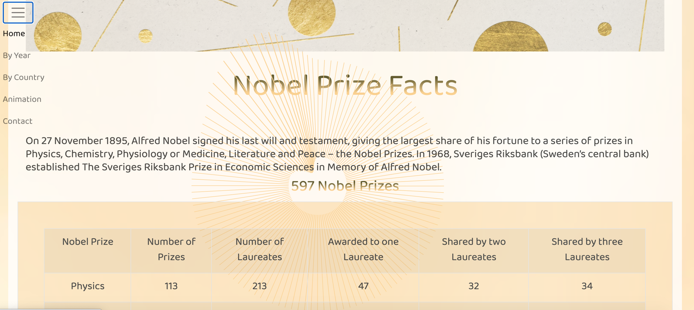
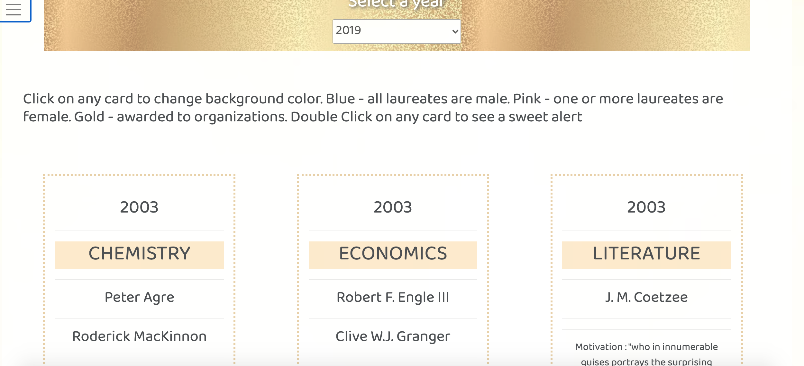
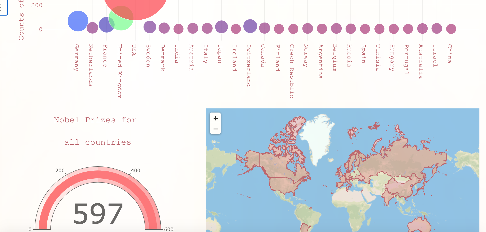
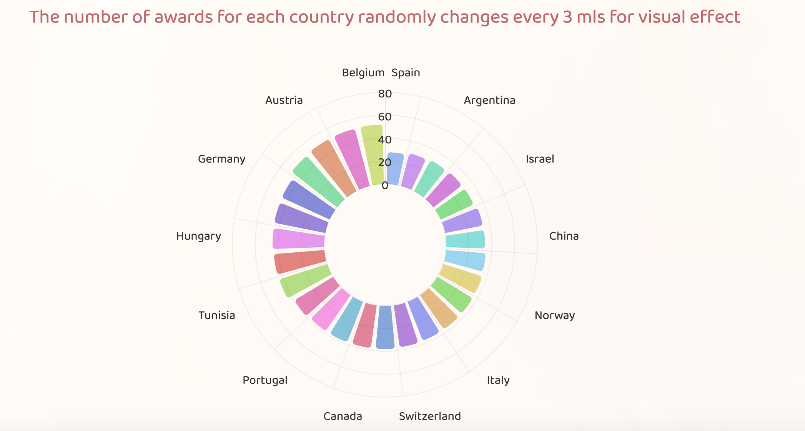
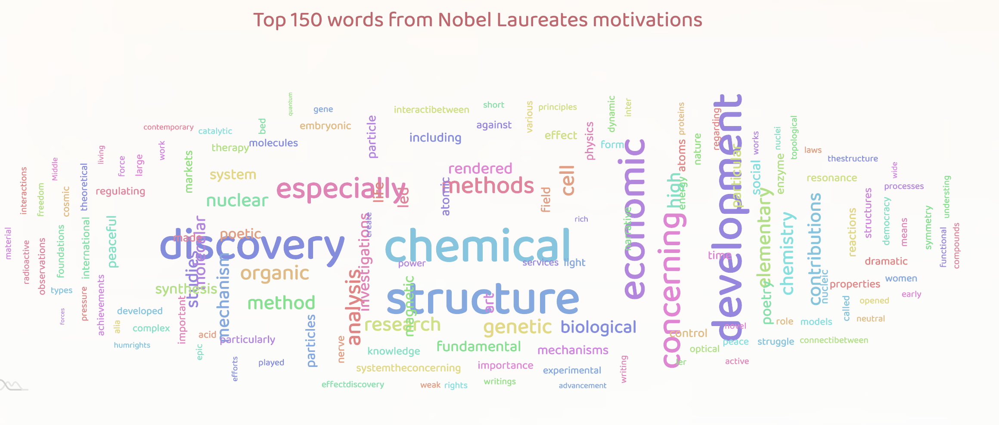

Project idea - Nobel Prize Winners Data Visualization.
Site is published at https://linasachuk.github.io/NobelData/

Visualization will include a Python Flask–powered RESTful API, Selenium WebDriver, HTML/CSS, JavaScript, D3, amCharts, SweetAlert, Anime.js and MongoDB cloud database.

Data are from the API http://api.nobelprize.org to create a database and https://www.nobelprize.org/ to web-scrape the interesting quick facts.

Nobel laureates database which we have retrieved as nobel. The database has three collections, prizes, laureates and facts. In the prizes collection, every document correspond to a single Nobel prize, and in the laureates collection - to a single Nobel laureate. The facts collection has a document with a quick facts about history of the Nobel Prize.

Data timeline is between 1901 and 2019, the Nobel Prizes were awarded 597 times to 950 people and organizations.

Using amCharts dataviz libraries (https://www.amcharts.com/) for Radar Chart. Radar chart is used to display directional or circular visual representation of a 2-dimensional data

Using amCharts dataviz libraries (https://www.amcharts.com/) for Word Cloud Chart. It helps visualize weight or importance of individual words from a keyword list from Nobel Prize Winners Motivations.

SweetAlert JavaScript library is very easy to use and can help modernize the default boring JS alert we are used to customizable and beautiful ones. SweetAlert makes popup messages easy and pretty.

Anime.js is a lightweight JavaScript animation library with a simple, yet powerful API.
It works with CSS properties, SVG, DOM attributes and JavaScript Objects.
